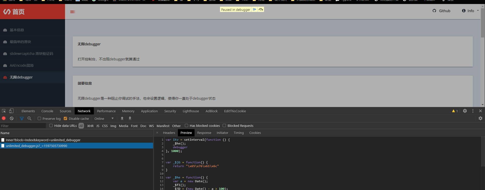
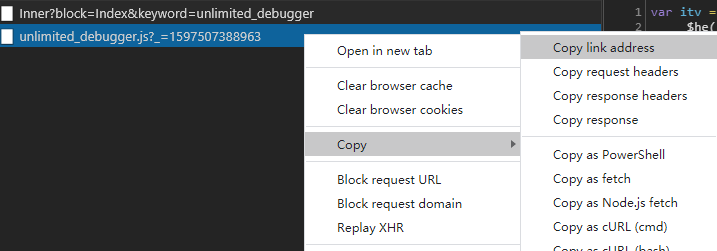
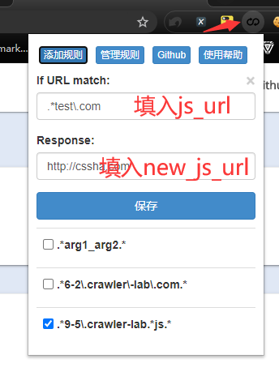

## 基本信息
来自于这个项目web部分的一个爬虫练习  

## 使用的包/工具/技术
|步骤|包/工具/技术|
|--|--|
|网页分析|Devtools|

## 问题与对应处理  
### 无限debugger  
想方设法跳出debugger循环，可以采用Hook手段

## 分析  
为了方便观察，在其上打上一些注释  
在js中，其中有一些 16进制字符串(特点带一个是`\x`)，可以重新编码转换回普通字符  
~~~javascript
function _$jG() {
    // return "eval"
    return "\x65\x76\x61\x6c"
}

function _$he() {
    var a = new Date();
    _$fI();
    _$jD = (new Date() - a > 100);
    if (_$jD) {
        _$hR()
    }
}

function _$fI() {
    // 获取eval函数，传入包含debugger代码
    window[_$jG()](_$hu());
    // 直接 debugger
    debugger
}

function _$hu() {
    // "return (function(){vara=newDate();debugger;returnnewDate()-a>100;}())"
    return "\x28\x66\x75\x6e\x63\x74\x69\x6f\x6e\x28\x29 \x7b\x76\x61\x72 \x61 \x3d \x6e\x65\x77 \x44\x61\x74\x65\x28\x29\x3b \x64\x65\x62\x75\x67\x67\x65\x72\x3b \x72\x65\x74\x75\x72\x6e \x6e\x65\x77 \x44\x61\x74\x65\x28\x29 \x2d \x61 \x3e \x31\x30\x30\x3b\x7d\x28\x29\x29"
}

function _$hR() {
    // 通过window获取eval函数
    _$r3 = window[_$jG()];
    // 通过eval函数内容.toString得到 eval函数内容，通过判断是否包含native 来判断是否是原生函数
    if ((_$r3 + "").indexOf("native") == -1) {
        while (1) {
            _$fI()
        }
    }
    var a = _$r3(_$hu());
    _$st = a;
    if (_$st) {
        _$he()
    }
}

(function () {
    // 定时器，每个一段时间执行其中内容
    setInterval(function () {
        _$he()
    }, 4000)
}());
~~~

### 形成原因
无限`debugger`其实有两种形式  
* 定时`debugger`  
将`debugger`写进定时器里，每过一段时间执行一次  
在上面代码中    
~~~javascript
setInterval(function () {
        _$he()
    }, 4000)
~~~
就是这种形式

* 循环`debugger`  
死循环中写入`debugger`就能造成这种效果  
在上面代码中    
~~~javascript
function _$he() {
    var a = new Date();
    _$fI();
    _$jD = (new Date() - a > 100);
    if (_$jD) {
        // 包含_$hR
        _$hR()
    }
}
function _$hR() {
    _$r3 = window[_$jG()];
    if ((_$r3 + "").indexOf("native") == -1) {
        while (1) {_$fI()}
    }
    var a = _$r3(_$hu());
    _$st = a;
    if (_$st) {
        // 包含_$he
        _$he()
    }
}
~~~
`_$he函数`中包含`_$hR函数`，`_$hR函数`中也包含`_$he函数`，而其中包含了debugger语句  
就是这种形式

## 处理  
可以通过中间人来处理  

这里我使用`reres`来处理  
>`reres`是一个浏览器插件，它能根据将返回的资源进行重定位  
可以利用它，用 自己定义的js文件 替代 返回的js文件 ，把debugger相关代码删除，处理无限debugger的目的  
>reres github地址：https://github.com/annnhan/ReRes  

### 过程
1. 响应url  
在`Devtool`的网络面板中找到js文件目标  
  
将其响应的url记录下来（后续称之为js_url）  

2. 改写js并保存  
将js文件保存下来，并且改写内容  
  
由于整个无限debugger的入口函数是一个定时器，这里我直接将整个定时器给注释标记，取消其作用  
在实际项目中，请不要那么暴力直接去掉最外层函数，建议结合 调用堆栈 和代码，一点一点删去  
过于粗略的删去可能会导致业务逻辑也出问题  
将修改好以后的js文件路径记录下来（后续称之为new_js_url）

3. reres规则写入  
打开插件，添加规则，填入项目，保存，勾选启动  
  

>* If URL match： 一个正则表达式，当请求的URL与之匹配时，规则生效。注意:不要填开头的/和结束的/gi，如/.*/gi请写成.*  
>* Response： 映射的响应地址，这个地址会替换掉url中与上面正则匹配的部分。  
线上地址请以`http://`开头，本地地址以`file:///`开头，比如http://cssha.com或file:///D:/a.js  

4. 刷新页面以验证修改  

Recluse 2020年8月13日14:53:10 
