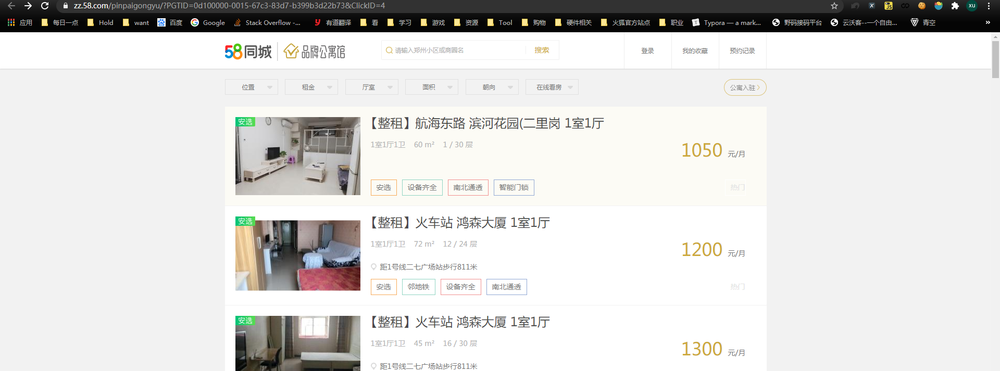

## 基本信息
目标URL：https://zz.58.com/pinpaigongyu/?PGTID=0d100000-0015-67c3-83d7-b399b3d22b73&ClickID=4  
<!--  -->
  

## 描述  
静态网页（如果你不刷更多内容，它会是静态）  
58同城的品牌公寓信息
对CSS字体加密问题的一次尝试，并非大规模抓取  

## 使用的包/工具/技术
| 步骤       | 包/工具/技术 |
| ---------- | ------------ |
| 网页分析   | Devtools     |
| 爬取网页   | requests     |
| 解析网页   | re  xpath    |
| 数据持久化 | json         |

## 问题与对应处理  
* 字体反爬  
自定义字体，改变`unicode字符`映射关系，使得一些内容无法正常解析  

## 分析  
### 字体反爬思路整理
#### `&#x`  
`&#x`是一个特殊的前缀，这是经过浏览器转义过后的`Unicode`字符标识符，作用就和python里的`\u`差不多  
它会让浏览器识别出这整个东西（直到后面的`;`为止）是用来表示一个`unicode字符`的  
浏览器识别出来后，会自动将其转化为对应的`Unicode字符`  
在默认的情况下，浏览器会使用默认的`Unicode码表`，但如果人人都使用默认码表，那么就不存在加密的可能性了  

#### 字体反爬思路  
字体反爬设计者 会通过自定义一个字体，更变字符映射关系  
将一些原本指向非常少用的`Unicode字符`的`字符码`指向其 自定义的字符(数字字母之列的)  
如果爬虫者不处理其自定义的`Unicode字符关系`，那么通过爬虫得到的网页会是用标准`Unicode`码表处理以后得到的结果（即，一个非常少用的`Unicode字符`），从而得不到正确信息

#### 反反爬思路
需要做的是: 找出正确的`Unicode码`与`Unicode字符`关系，用正确的字符取代网页上的`Unicode码`  

### 字体处理过程  
网页整体爬取并没有什么大问题，设置一个比较合理的头部即可获取  
唯一需要解决的就是字体的问题  
<!--  -->
  
<!--    -->
  

#### 寻字体定义  
首先从找寻字体定义开始  
<!--    -->
  

留意到绑定了很多种字体  
* `fangchan-secret`  
其自定义的字体，也是接下来要处理的字体  
* `Hiragino Sans GB`  
冬青黑体简体中文。能够在网上找到字体本体的字体，并非自定  
* `Microsoft yahei`  
微软雅黑。能够在系统中找到字体本体的字体，并非自定  
* `Arial`  
Arial字体。能够在网上找到字体本体的字体，并非自定  
* `sans-serif`  
一种经常使用的西文字体。能够在网上找到字体本体的字体，并非自定  
* `"\5B8B\4F53"!important`  
  * \5B8B\4F53宋体。没错，是宋体，因为直接在CSS中写中文"宋体"来定义的话，可能会出现编码问题，所以使用这种方式来定义  
  * !important，作用是提高指定样式规则的应用优先权（优先级）

全局搜索`fangchan-secret`
<!--    -->
  
最终，在html中找到定义  
<!--    -->
  

#### 字体信息获取  
对定义进行分析  
<!--    -->
  

那么手法还是明显的，这是一段由`Base64`处理`ttf字体信息`得到的结果  
那么现在，为了得到字体文件，我需要将这个结果还原回`ttf字体信息`  

~~~python
def get_font_ttf(html: str):
    '''
    解析字体内容
    '''
    print('正在从html中获取字体信息')
    pattern = re.compile(r"font-family:'fangchan-secret';[\s\S]+?data:application/font-ttf;[\s\S]+?;(.*?),(.*?)'\)")
    font_info_b64 = re.findall(pattern, html)
    print(font_info_b64[0])

    font_info = base64.b64decode(font_info_b64[0][1])
    with open('example/未完成_CSS字体反爬/58_font.ttf', 'wb')as f:
        f.write(font_info)
        print('字体内容解码完毕，已保存ttf文件')
    return font_info
~~~

在保存好`ttf文件`以后，利用 [百度字体编辑器](http://fontstore.baidu.com/static/editor/index.html) 取字体与`Unicode值`与`实际值`关系  

<!--    -->

>此处有多种选择方式  
>* 可以从xml里拿到坐标，然后matlap画图做ocr  
>* 可以记录坐标特征，下次碰到识别坐标特征就反推关系  
>* 可以用百度字体编辑器手工处理  
>
>由于我并不打算重复抓取，所以这个字体是相对固定不变的  
这里选择用百度字体编辑器手工的方式得到结果  

~~~python
{'9fa4': 0, '9ea3': 1, '9f92': 2, '993c': 3, '9a4b': 4, '958f': 5, '9476': 6, '9e3a': 7, '9fa5': 8, '9f64': 9}
~~~
整理数据，得到{`html转义unicode字符`:`实际值`}这种形式  
~~~python
print('字典key转16进unicode html转义')
    convert_uh2val_dict = {}
    for _key, _val in convert_u2mid_dict.items():
        _key = hex(_key)
        convert_uh2val_dict['&#x' + _key[2:] + ';'] = baidu_font_dict[_key[2:]]
    print(convert_uh2val_dict)
~~~

最后就是利用转化字典，将html里的那些unicode转为实际值  
~~~python
print('将html中自定义字体值转为真实值')
    for word, value in convert_u2val_dict.items():
        html_str = html_str.replace(word, str(value))
~~~
如此一来就解决了字体加密的问题了  
余下的就是简单的解析数据  

这个网页的话，是一个动态网页，但数据是静态的  
抓取到第一页，解析出字体，解析好内容以后，再模拟ajax得到剩余的动态网页来解析即可  

全部代码见：`spider.py`

Recluse 2020年8月29日12:42:47
