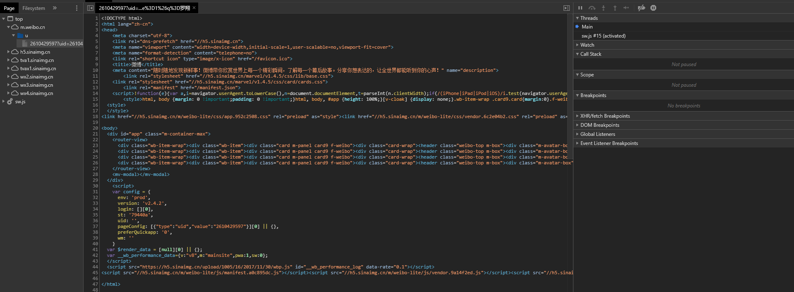
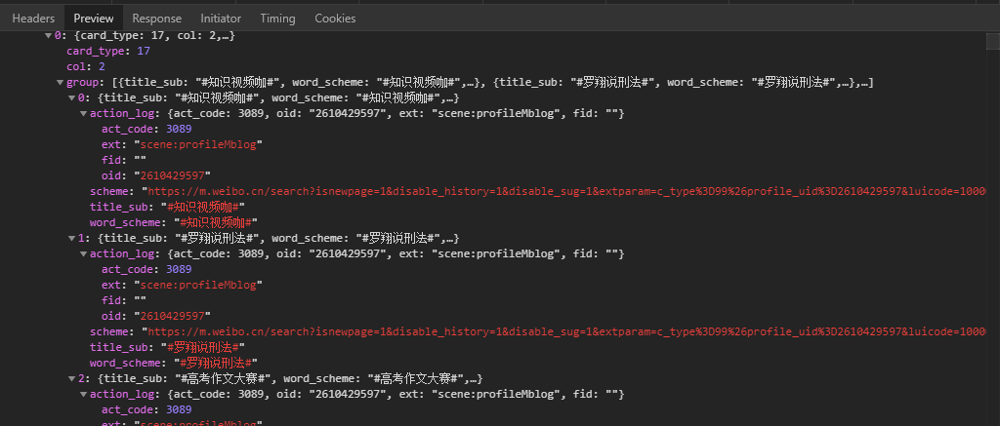
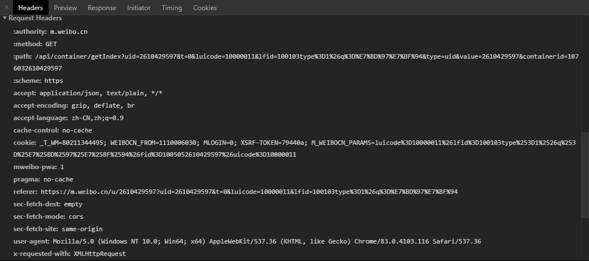

## 基本信息
目标URL：https://m.weibo.cn/u/2610429597?uid=2610429597&t=0&luicode=10000011&lfid=100103type%3D1%26q%3D%E7%BD%97%E7%BF%94  

## 描述  
分析完毕以后发现是动态网页，js没有混淆没有加密  
所以到最后代码写出来，与其说是在爬虫，更像是在调用API

## 使用的包/工具/技术
|步骤|包/工具/技术|
|--|--|
|网页分析|Devtools|
|爬取网页|requests|
|解析网页|json|

## 问题与对应处理  
### IP访问频率  
懒得弄代理，选择每次爬取后等待一段时间  
### User-Agent限制  
请求头填写自己编写`User-Agent`即可  
### 模拟Ajax请求  
请求头填写自己编写`X-Requested-With`即可  

## 分析
### 打开用户页，发现参数有挺多  
  
url: https://m.weibo.cn/u/2610429597
* uid=2610429597
* t=0
* luicode=10000011
* lfid=100103type%3D1%26q%3D罗翔

### 查看网页源码  
  
看到其网页本身并没有任何的用户信息，判断是一个动态页面  

### 寻找Ajax目标数据包  

根据响应内容来判断是哪个Ajax数据包  
发现一个响应包含了动态的内容，于是确认数据包  

### 观察目标数据包header  

url: https://m.weibo.cn/api/container/getIndex  
|请求参数|值|信息|
|--|--|--|
|uid |2610429597|猜测是userid 一个用户一个 |
|t|0|猜测为固定值 不同页面Ajax请求，此值均为0|
|luicode |10000011|猜测为固定值 不同用户页面值均相同，视为固定参数置之不理  |
|lfid |100103type%3D1%26q%3D罗翔|猜测前面是固定参数，后面是姓名 查询不同用户的页面url，发现前半段都一样，只有最后不一样|
|type |uid|猜测这里指用用户id来查询|
|containerid|1076032610429597  |猜测为固定值 同一用户`Ajax`，此值均相同|
|since_id|4523675364289273|猜测为页面相关值 第一次发送`Ajax`请求时，无需此参数 同一用户，越新的动态，此值越大|

最后一个参数较为重要，但无法直观的获知其值的逻辑，需要进行分析  

### since_id  
进行多次Ajax抓包，发现其第一次发送的`Ajax`请求中，并不需要`since_id`参数  

  
在资源面板里全局搜索`since_id`，发现只在`page.143ecddd.js`中出现过  

  
找到发送请求的源码，发现是`AngularJS`，打上断点  

  
再次请求后不断观察变量情况，反推何时得到`since_id`  

  
最终发现，这个值在第一次没有`since_id`的`Ajax`响应中有  

Recluse 2020-7-23 23:12:00 
